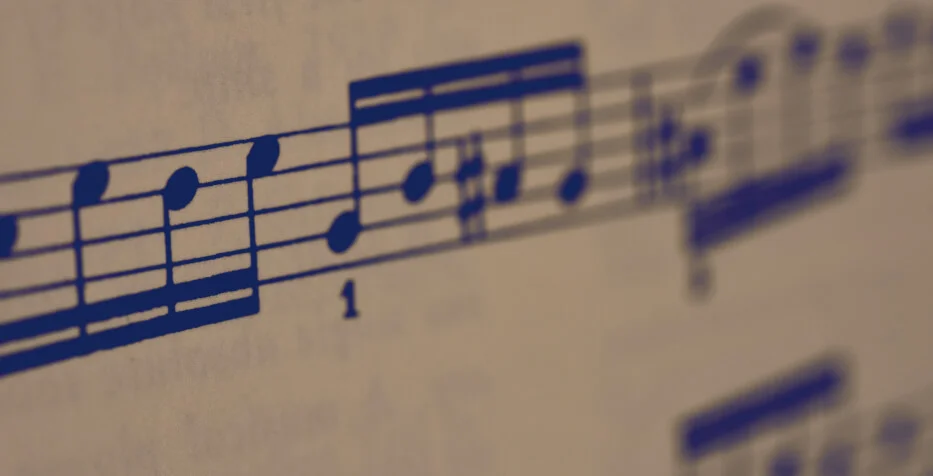

# beethoven-sheet

## Beethoven Sheet

### Introduction

[https://github.com/vietphan1995/beethoven-sheet.git](https://github.com/vietphan1995/beethoven-sheet.git)

Beethoven sheet is an application software that helps you edit music note sheet.

Beethoven sheet supports reading, writing, importing, exporting music note sheet file for playing with instrument, sharing others.

Beethoven sheet bring best practicing, performing with instrument by quality in alignment, size note adjusting sheet that visualizes on smart device screen, also user interface color when you read to play in your music environment, example dark mode view on dark stage.

Beethoven sheet supports ruling, input from musical instrument or supported digital hardware in supporting method like bluetooth.

In climate change, beethoven sheet helps reducing paper for editing, managing, creating, create happiness and meaningful life through music.

### [back to git projects …](https://github.com/vietphan1995/projects)

### Notes
https://phantrungviet.notion.site/beethoven-sheet-1b25e832d6ee80d79a17d36181726e77